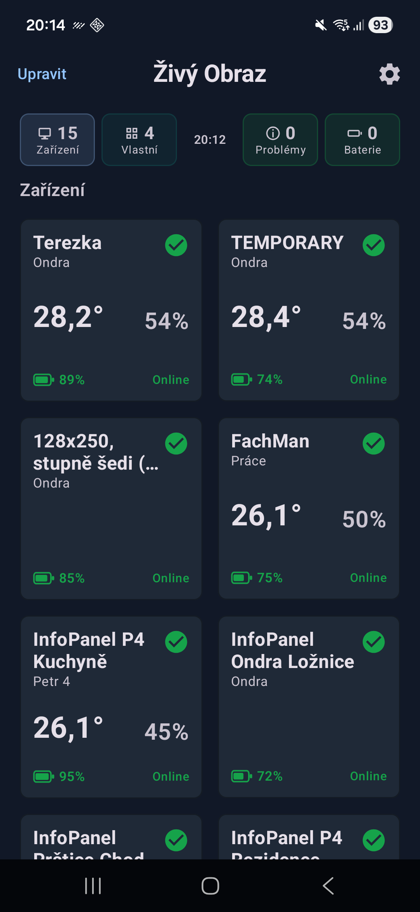
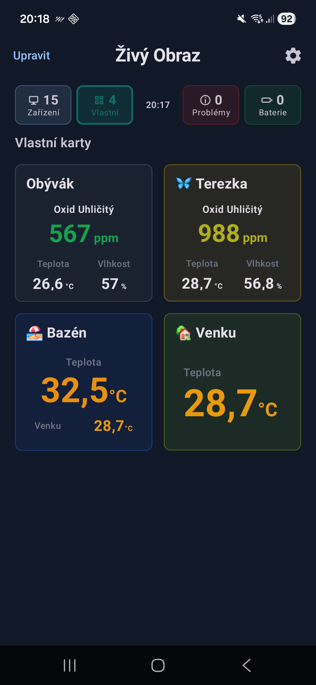
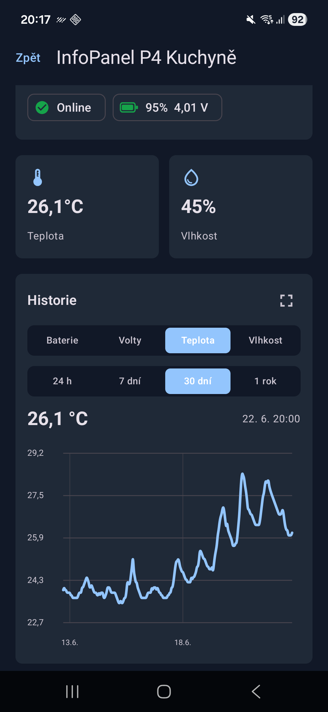
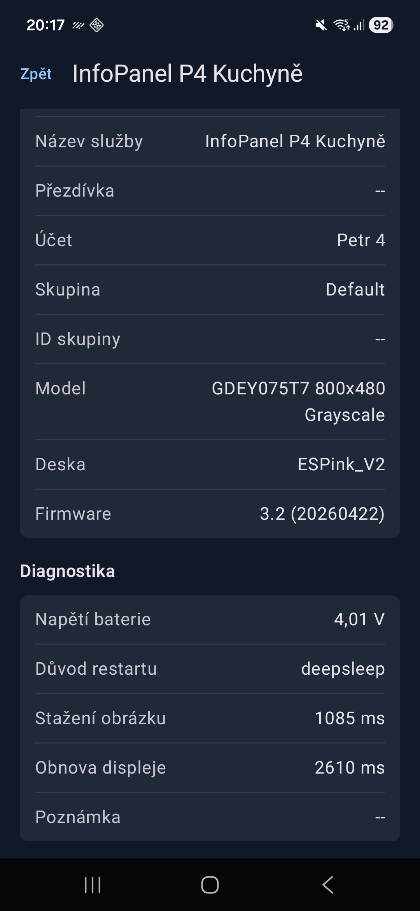
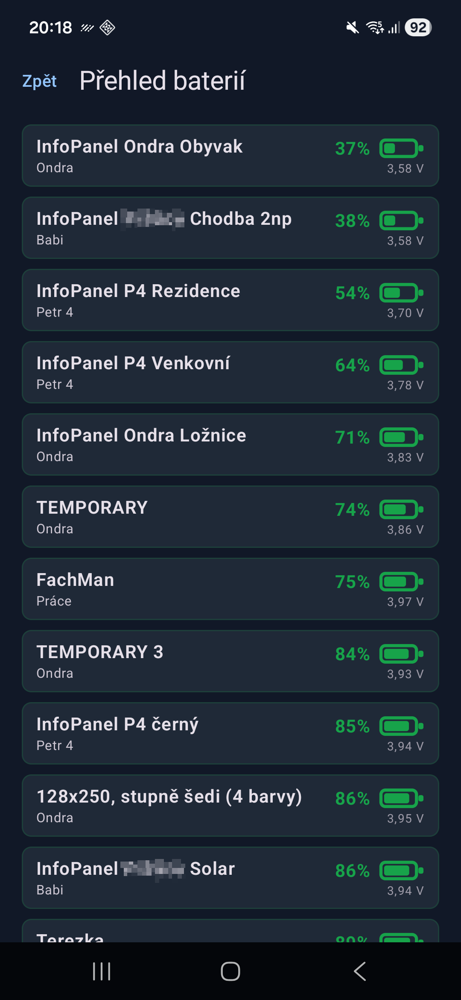
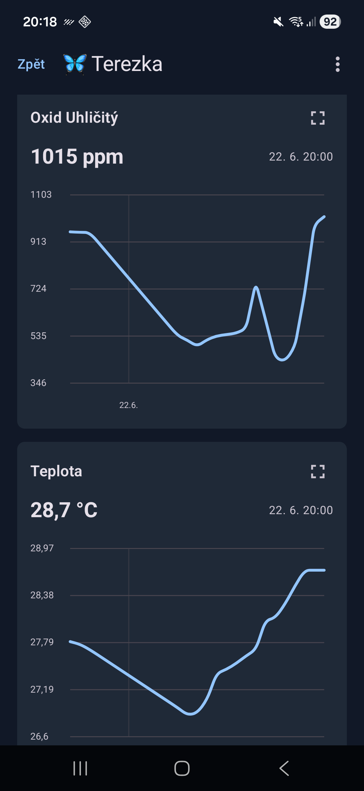
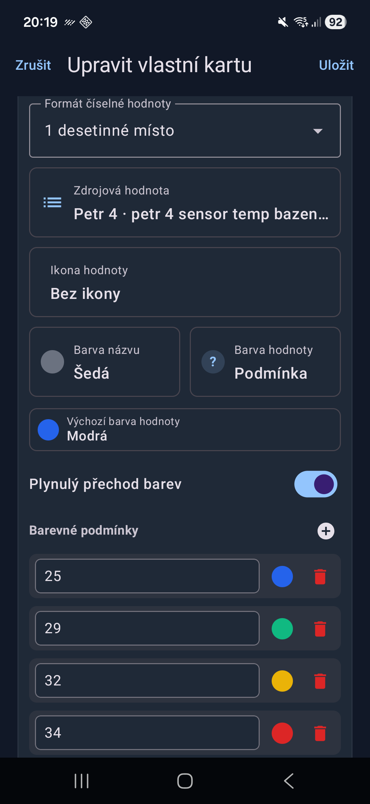
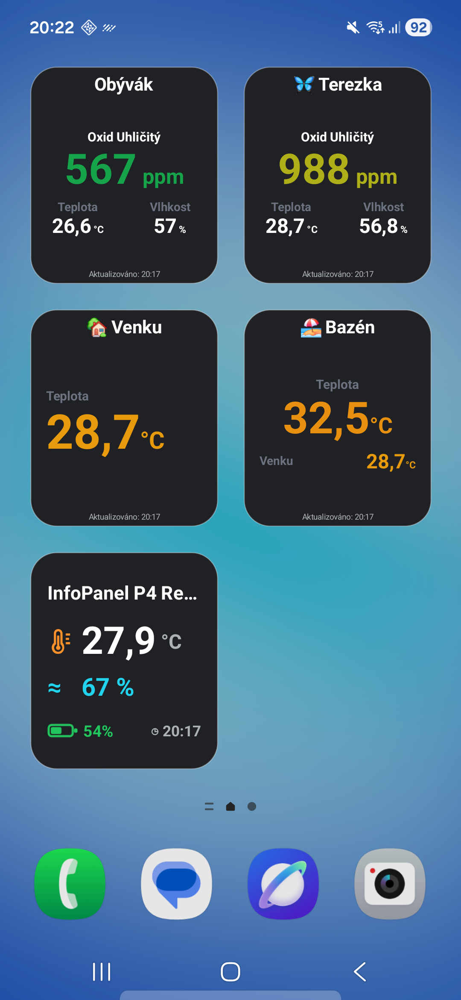
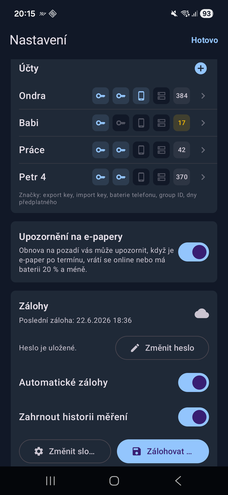
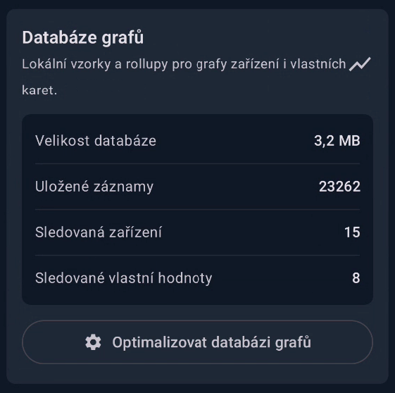

# Živý Obraz for Android

[Česká verze](README.md)

An Android app for a quick overview of devices from the [**Živý Obraz**](https://zivyobraz.eu/?page=o-sluzbe) service. On your phone, it shows e-paper status, measured and custom values, batteries, chart history, local alerts, backups, and Home Screen widgets.

## Open Beta Testing

The app is available in Open Beta on Google Play. You do not need to send an email or wait to be added to a testing group.

You can find it on Google Play under the name **Živý Obraz**. You can also install it by opening this link directly on your Android device:

https://play.google.com/store/apps/details?id=eu.coolajz.zivyobraz

You can also use the testing web link:

https://play.google.com/apps/testing/eu.coolajz.zivyobraz

## Main Features

- **Overview of all devices** - temperature, humidity, pressure or CO2, battery, online status, dashboard summary, and quick issue filtering.
- **E-paper battery overview** - a separate list sorted by battery level, including devices without an available percentage.
- **Local e-paper alerts** - Android notifications for newly overdue devices, recovery, and battery at 20% or lower.
- **Home Screen widgets** - one widget for a specific e-paper and three widget sizes for custom cards.
- **Custom cards for any values** - build a card from values available in the `my_values` export, with layouts, icons, colors, prefixes, suffixes, number formatting, and conditional colors.
- **Automatic data updates** - manual refresh, refresh when returning to the app, widget refresh, and scheduled background refresh through Android WorkManager.
- **Device detail and charts** - signal, battery, firmware, last contact, diagnostics, and measurement history with fullscreen charts.
- **Multiple accounts and groups** - multiple export keys, optional Group ID filtering, QR code key scanning, and account subscription information.
- **Dashboard customization** - custom aliases, device and custom card ordering, and hiding unused e-paper devices.
- **Optional phone battery reporting** - the Android phone battery level can be sent back to Živý Obraz through the import API.
- **Encrypted backups** - manual and optional automatic backups of settings, saved keys, and optionally measurement history.
- **Diagnostics tools** - debug log, last background refresh status, phone battery push diagnostics, build information, and local chart database overview.

## App Screenshots

### Device Overview

The dashboard shows e-papers in cards, a summary for devices, custom cards, issues, and batteries. Tapping the summary items quickly filters the view.

  
  

### Device Detail and History

Device detail shows current values, contact status, battery, history charts, and technical diagnostics for the e-paper.

  
  

### Battery Overview

The separate battery overview helps you quickly find e-papers with the lowest battery and also shows battery voltage.

  

### Custom Cards and Widgets

Custom cards can combine values from the `my_values` export and use custom icons, colors, layouts, and conditional colors. The same cards can also be added as Android Home Screen widgets.

  
  

  

### Settings, Backups, and Chart Database

Settings include account management, e-paper alerts, encrypted backups, and an overview of the local chart database.

  
  

## How to Set Up the App

### 1. Prepare an Export Key

Prepare an **export key** in the Živý Obraz service. The app uses it to load e-papers, account information, and custom values.

If you want to show only a selected group of devices, also prepare a **Group ID**. This step is optional.

### 2. Add an Account in the App

1. Open the Živý Obraz app.
2. Open **Settings**.
3. Select an existing account or tap **Add another account**.
4. Enter an account name.
5. Paste the export key or scan it from a QR code.
6. Optionally enter a Group ID.
7. If you want to send the phone battery level to Živý Obraz, enable the option and enter an import key and device name.
8. Save the changes with **Done**.

After saving, the app checks the account settings, loads e-papers, stores data for widgets, and can also show account subscription information.

Saved export and import keys are not shown in full again in the editor. To replace them, use **Re-enter key** or remove and add the account again.

### 3. Add a Home Screen Widget

1. On the Android Home Screen, touch and hold an empty area.
2. Choose **Widgets** and find **Živý Obraz**.
3. Add the e-paper widget.
4. During configuration, select a specific device or keep **Automatic**.

The widget uses the last loaded data and schedules updates through Android WorkManager. If no data is available while adding the widget, open the app and run a manual refresh first.

### 4. Create a Custom Card and Widget

1. On the dashboard, open the **Custom** section or tap the button to add a custom card.
2. Choose the card name, icon, color, and layout.
3. Add values from the `my_values` export.
4. For each value, set the label, icon, label color, value color, prefix, suffix, and optional number format.
5. For numeric values, you can configure conditional colors and smooth color transitions.
6. Add a small, medium, or large custom card widget to the Home Screen and select the created card.

A custom card is useful for outdoor temperature, humidity, pressure, CO2, air quality, energy usage, battery status, or any other value available in your export.

## Dashboard, Batteries, and Chart History

The dashboard shows e-papers and custom cards in one overview. The top summary shows devices, custom cards, issues, and weak batteries. Tapping a summary item switches the filter to all devices, custom cards, issue devices, or low-battery devices.

A device is considered **overdue** when it is more than 15 minutes past its expected next contact. A weak battery in the dashboard means roughly 30% or lower.

The battery overview shows e-papers sorted from the lowest battery level upward. Devices without an available battery percentage are separated so it is clear that the app cannot sort them precisely.

Device detail includes:

- current temperature, humidity, pressure, or CO2 values,
- contact status, last contact, and next expected contact,
- Wi-Fi SSID and RSSI,
- account, group, model, resolution, colors, board, and firmware,
- battery voltage, reset reason, picture download time, and display refresh time,
- history for battery, voltage, temperature, humidity, and pressure or CO2.

Charts support **24 h**, **7 d**, **30 d**, and **1 y** ranges. A chart can be opened fullscreen, and holding or dragging on it shows the value at a specific time. The last selected metric and range are saved per device.

Chart history can be cleared for a specific e-paper or a specific custom card. Settings also include an overview of the local chart database with size, record count, tracked devices, and tracked custom values.

## Custom Cards and Widgets

Custom cards are populated from values available in the `my_values` export. One card can use values from different accounts. Values can be text, integer, decimal, boolean, or empty; history is stored only for numeric values.

Available layouts:

- **1 dominant** - one large value.
- **2 split** - two balanced values.
- **3 mixed** - one primary value and two smaller values.
- **4 grid** - four compact values.
- **List** - up to six rows.

The editor supports duplicating cards, reordering cards, selecting icons by category, choosing from a color palette, custom prefixes and suffixes, half-size suffixes for units, number formatting as a whole number or 1 to 3 decimal places, and conditional colors based on thresholds.

Custom card widgets are available in three sizes:

- **Small widget** supports 1 dominant, 2 split, 3 mixed, and list layouts.
- **Medium widget** supports 1 dominant, 2 split, 3 mixed, and 4 grid layouts.
- **Large widget** supports all layouts.

If a card contains numeric values, the app stores a separate history for it. The custom card detail then offers charts with the same ranges as e-paper charts.

## Local E-paper Alerts

The app can send Android notifications when e-paper status changes. The feature is enabled in app settings, but on Android 13 and newer, the system notification permission must also be granted.

The app can notify you about:

- a newly overdue e-paper,
- a device returning online,
- e-paper battery dropping to 20% or lower.

Alerts are evaluated during background refresh. The app stores the last known device state so it does not send the same notification repeatedly. Low-battery alerts use a one-day cooldown to avoid too frequent repeats.

## Background Data Refresh

The app uses Android WorkManager:

- the main background refresh is scheduled every 30 minutes and requires network connectivity,
- widget refresh is scheduled every 15 minutes and also requires network connectivity,
- when the app returns to the foreground, data is refreshed if it is older than roughly 5 minutes.

Android may delay background work in Doze mode, battery saver, or because of device manufacturer rules. If updates arrive later than expected, setting app battery usage to **Unrestricted** in Android system settings can help.

Settings show diagnostics for the last scheduled, started, and finished background refresh run.

## Sending Phone Battery to Živý Obraz

Each account can optionally send the phone battery level to Živý Obraz. You need to:

- enable **Send device battery to ŽO**,
- enter an import key,
- enter the device name under which the battery should be written in Živý Obraz.

The app sends battery percentage and charging state to the Živý Obraz import endpoint. Settings include a manual send test and diagnostics for the last attempt.

## Backups and Restore

The Android version uses local encrypted backups to a folder selected by the user. This is not cloud synchronization; it is a file saved to a selected folder on the device or storage available through the Android file picker.

A backup always contains:

- app settings,
- accounts,
- aliases,
- device ordering and hidden devices,
- custom cards,
- saved export and import keys.

It can optionally include the local measurement history database used for charts.

The backup is protected by a password of at least 8 characters. The file uses the `.zivybackup` format and is encrypted with AES-256-GCM; the encryption key is derived from the password using PBKDF2WithHmacSHA256.

In settings, you can:

- choose a backup folder,
- set or change the password,
- choose whether to include measurement history,
- enable automatic daily backups,
- start a manual backup,
- restore data from a backup.

Automatic backups run once per day when Android allows background work and the battery is not low.

## Settings, Diagnostics, and Privacy

Settings include account management, alerts, backups, chart database, background refresh, phone battery reporting, debug log, and app build information.

Export and import keys are stored in encrypted Android SharedPreferences. Regular configuration, device cache, custom cards, and dashboard state are stored locally on the device. Measurement history is stored in a local SQLite database.

The app communicates with the Živý Obraz service through:

- export API: `https://out.zivyobraz.eu/`
- phone battery import API: `https://in.zivyobraz.eu/`

Data handling details are available in [privacy.md](privacy.md).

## Technical Information

- Platform: Android
- Application package: `eu.coolajz.zivyobraz`
- Minimum Android SDK: 26
- Target Android SDK: 35
- Language: Kotlin
- UI: Jetpack Compose and Material 3
- Background sync: WorkManager
- Local storage: SharedPreferences, EncryptedSharedPreferences, and SQLite
- Widgets: AppWidgetProvider and RemoteViews
- QR scanning: CameraX and ML Kit Barcode Scanning
